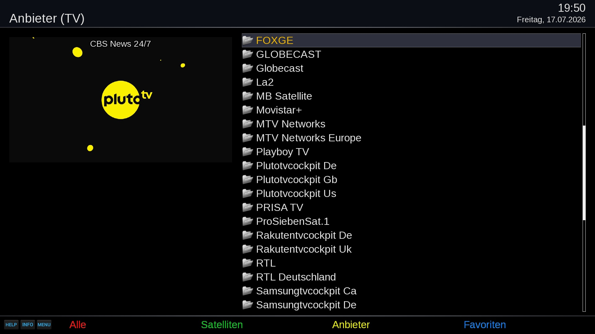
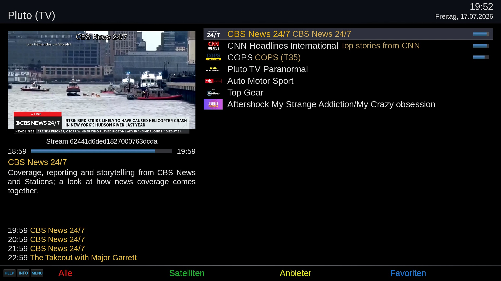

# IPTVServiceCockpit (ISC)
Open-Enigma2 plugin for integrating IPTV services into the DVB service architecture.

## Providers

## Favourites

## Goal
This plugin aims at integrating IPTV services seamlessly into the DVB service architecture instead of just using separate favourite bouquets. For the user, an IPTV service ultimately becomes just another service, handled the same way as a DVB service.

## Features
- Integrates IPTV channels as providers instead of favourite bouquets in Enigma2.
- Enables "true" IPTV favourite bouquets that don't need to be updated when URLs change after a provider scan/update: each favourite resolves its current stream URL at the moment of playback by re-reading the provider's playlist, so a URL rotation never breaks it.
- Matches channels by `tvg-id` where available, so favourites and reordering survive even if a provider reshuffles its playlist; falls back to matching by channel name for playlists without `tvg-id`.
- Plays nicely with PlutoTVCockpit, RakutenTVCockit, or SamsungTVCockpit: channels backed by its local proxy are handed off to the plugin's own resolution instead of being resolved here.
- other work in progress...

## How it works
ISC scans `/etc/enigma2/channellist*.m3u8` for playlists and lists each one as a "provider" in the channel selection, right alongside your regular bouquets/providers. Opening a provider shows its channels; playing or favouriting one works exactly like a normal service.

Unlike a plain M3U bouquet import, a channel entry never stores today's stream URL directly - it stores a reference to (provider file, `tvg-id`). The actual URL is looked up fresh from the playlist file at the moment you tune in or start a recording. That means:
- Updating/re-downloading a provider's `.m3u8` file to refresh rotated URLs doesn't require touching your favourites - they keep working.
- If a channel is removed from the playlist, the favourite simply fails to play, the same way a DVB favourite fails when its transponder no longer carries that service.

## Setup
1. Place one or more playlists at `/etc/enigma2/channellist*.m3u8` (any file matching that glob is picked up; a `channellist_myprovider.m3u8` file becomes a provider named "Myprovider").
2. Restart Enigma2 (or the plugin) so it picks up the new file(s).
3. Open channel selection and select "Providers" to browse the IPTV channels; add channels to your favourites the same way you would a DVB service.

## Limitations
- The plugin supports OpenViX and compatible distributions.

## Disclaimer
The project author is not responsible for how this software is used by others. It is not intended to be used for accessing or distributing copyrighted materials without authorization.
Users are solely responsible for determining the legality of their actions.

This repository has no control over the streams, links, or the legality of the content provided by the different hosts (including all mirror sites). It is the end user's responsibility to ensure the legal use of these streams, and we strongly recommend verifying that the content complies with all applicable laws, including copyright laws and regulations of your country's jurisdiction before use.

## Links
- Installation: https://OpenCockpit.github.io/IPTVServiceCockpit
